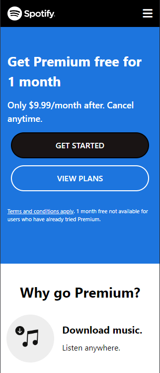
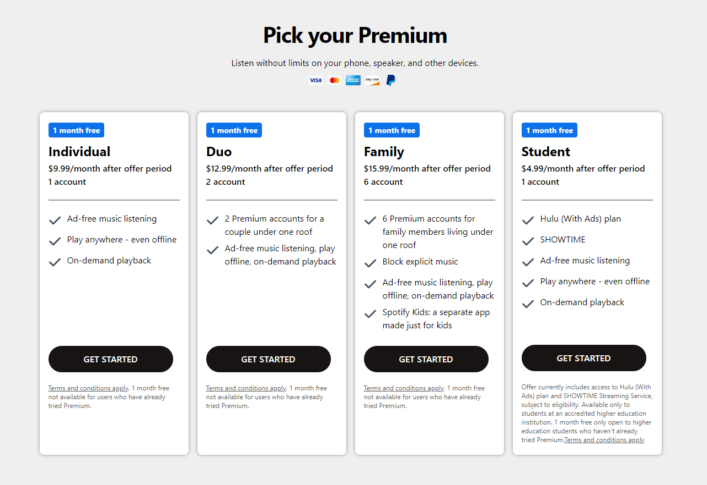
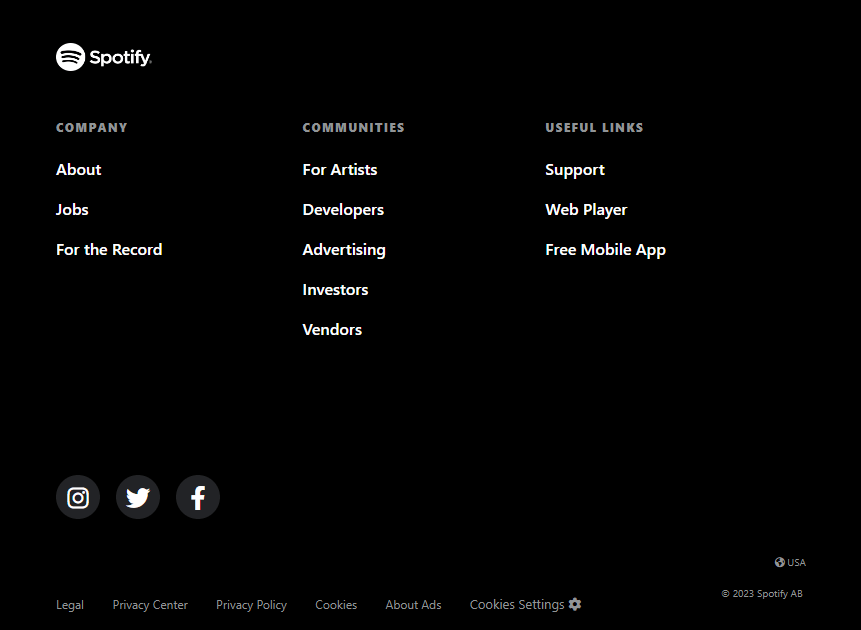

# Generador de Memes

Mi nombre es Rocío Magalí Chaparro, estoy estudiando para convertirme en desarrolladora Frontend Developer y en esta ocasión presento un proyecto para poner en práctica Tailwind.
***

## Índice

- [Descripción del proyecto](#Descripción-del-proyecto)
- [Herramientas utilizadas](#Herramientas-utilizadas)
- [Ver el proyecto](#ver-el-proyecto)
- [Desarrolladores](#desarrolladores)
- [Contacto](#contacto)

***

### Descripción del proyecto

Este proyecto es propuesto por ADA ITW para poner en práctica Tailwind tomando como referencia la página web de Spotify. ¿Qué es Tailwind?... Es un framework de CSS altamente personalizable que elimina los estilos pre-definidos de código abierto​ para el diseño de páginas web. Es totalmente adaptativo ya que Tailwind está pensado como mobile first y utiliza distintos tipos de brakpoints.

***

### Herramientas utilizadas
- HTML5
- Tailwind
- Git
- Github

***

### Ver el proyecto
Para poder visualizar el proyecto simplemente colocá el siguiente enlace en tu navegador preferido:

https://rocio-ch.github.io/practice-tailwind-spotify/

Diseño original: https://www.spotify.com/us/premium/

Preview del proyecto:

### Desarrolladores
- Rocío Magalí Chaparro

***
### Contacto
Si te gustó mi proyecto y te interesa mi trabajo, podes contactarme a cualquiera de mis redes sociales.

- ⚫ <a href="https://github.com/Rocio-Ch" name="github">Github</a> 
- 📧 <a href="mailto:rociomagali77@gmail.com" name="mail">Gmail</a>
- 🔗 <a href="https://www.instagram.com/rmc_nails/?hl=es" name="instagram" >Instagram</a>